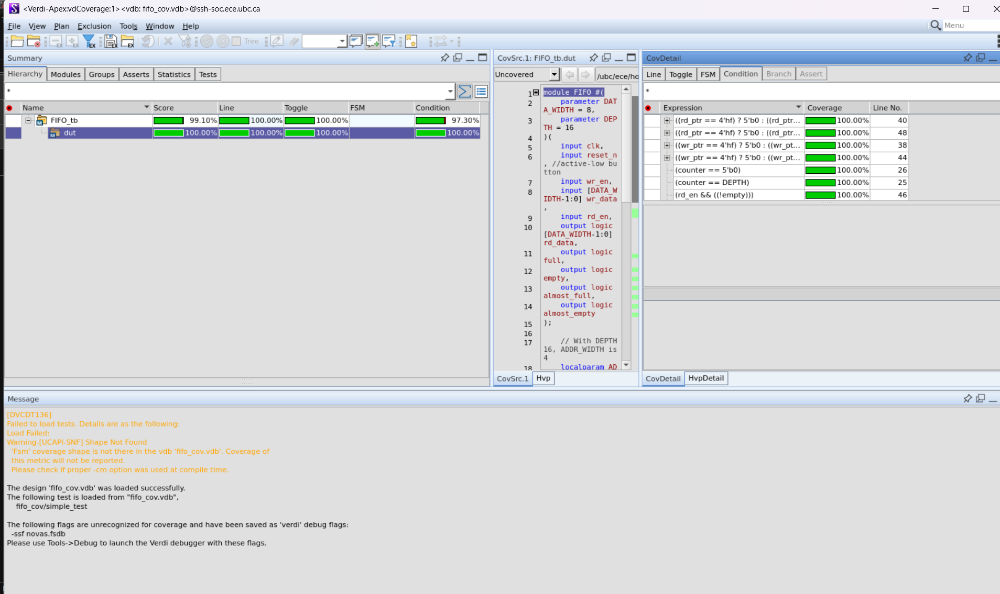
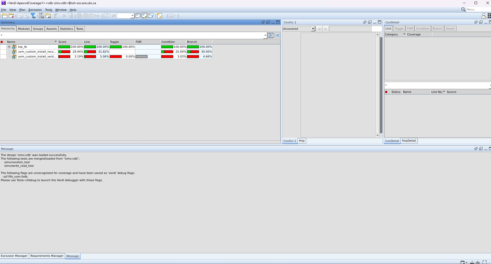
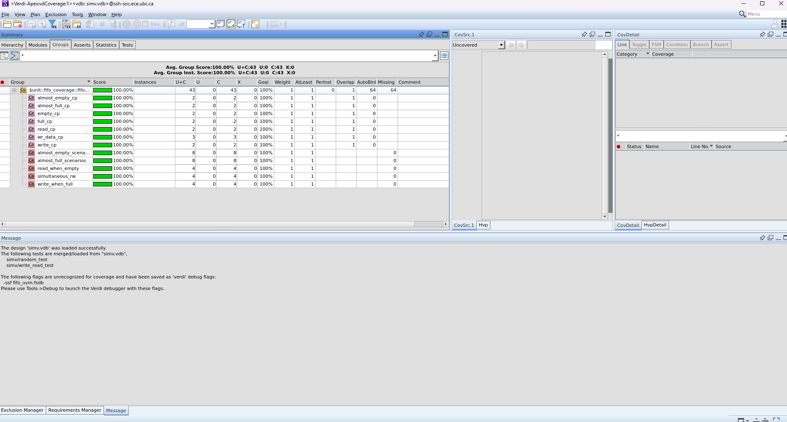

# FIFO-UVM
Register based FIFO tested with UVM

Requirements of this FIFO:

- Synchronous
- Register based
- Data width: 8 bits
- Depth: 16 entries 
- Total size: 8*16 = 128 bits
- Full, Empty, Almost Full, Almost Empty flags (almost full when 14 or more entries are filled, almost empty when 2 entries or less are filled)
- write enable, write data, read enable, read data signals
- Ignores illegal operations (write when full, read when empty)

Inputs:

- clk: Clock signal
- rst_n: Active low reset signal
- wr_en: Write enable signal
- wr_data[7:0]: 8-bit write data input
- rd_en: Read enable signal

Outputs:
- rd_data[7:0]: 8-bit read data output
- full: FIFO full flag
- empty: FIFO empty flag
- almost_full: FIFO almost full flag
- almost_empty: FIFO almost empty flag

Things to test:
- Reset Behavior at different scenarios (reset on and off when other vars are on)
- Normal write and read operations
- Full and empty conditions
- Almost full and almost empty conditions
- Simultaneous read and write operations (even when empty and full, only the write should operate if empty and read if full)
- Illegal operations (writing when full, reading when empty)
- Wrap-around behavior of read and write pointers (ring buffer implementation)


For coverage (FIFO-UVM):

VCS Compilation
```
vcs -sverilog -timescale=1ns/1ps -full64 -debug_access+all -kdb -cm line+cond+fsm+tgl -cm_dir fifo_cov.vdb rtl/FIFO.sv tb/FIFO_tb.sv -o simv
```

Simulation with coverage collector
```
./simv -cm line+cond+fsm+tgl -cm_dir fifo_cov.vdb -cm_name simple_test
```

View coverage result with Verdi
```
verdi -cov -covdir fifo_cov.vdb -ssf novas.fsdb &
```

To Clean and coverage as well
```
rm -rf fifo_cov.vdb simv* csrc *.log novas.fsdb
```

For UVM:
```
vcs -sverilog -ntb_opts uvm-1.2 rtl/FIFO.sv tb/fifo_tb_top.sv -o simv
```
with Verdi:
```
vcs -sverilog -ntb_opts uvm-1.2 -debug_access+all -kdb rtl/FIFO.sv tb/fifo_tb_top.sv -o simv
```
with Coverage:
```
vcs -sverilog -ntb_opts uvm-1.2 -debug_access+all -kdb -cm line+cond+fsm+tgl+branch rtl/FIFO.sv tb/fifo_tb_top.sv -o simv
```
Running it:
```
./simv +UVM_TESTNAME=fifo_random_test +UVM_VERBOSITY=UVM_HIGH

./simv +UVM_TESTNAME=fifo_write_read_test +UVM_VERBOSITY=UVM_HIGH
```
Run it WITH COVERAGE:
```
./simv +UVM_TESTNAME=fifo_random_test +UVM_VERBOSITY=UVM_LOW -cm line+cond+fsm+tgl+branch -cm_name random_test

./simv +UVM_TESTNAME=fifo_write_read_test +UVM_VERBOSITY=UVM_LOW -cm line+cond+fsm+tgl+branch -cm_name write_read_test

./simv +UVM_TESTNAME=fifo_coverage_test +UVM_VERBOSITY=UVM_LOW -cm line+cond+fsm+tgl+branch -cm_name write_read_test
```
To view the coverage:
```
urg -dir simv.vdb -format both

verdi -cov -covdir simv.vdb -ssf fifo_uvm.fsdb &
```
To view UVM structure with Verdi
```
./simv -gui +UVM_TESTNAME=fifo_random_test +UVM_VERBOSITY=UVM_HIGH +UVM_VERDI_TRACE="HIER+UVM_AWARE"
```

image taken from https://vlsiverify.com/uvm/uvm-environment/


## Coverage Results

### Code Coverage (Structural)
- **Overall Score:** 95.55%
- Line Coverage: 100%
- Branch Coverage: 90%
- Condition Coverage: 93.55%
- Toggle Coverage: 98.65%

### Functional Coverage (Behavioral)
- **Overall Coverage:** 97.22%
- Write operations: 100%
- Read operations: 100%
- Full flag scenarios: 100%
- Empty flag scenarios: 100%
- Almost-full scenarios: 100%
- Almost-empty scenarios: 100%
- Simultaneous read/write: 100%
- Data patterns: 66.67% (minor gap: 0xFF pattern)

### Critical Scenarios Tested
✓ FIFO completely full (16 items)
✓ FIFO completely empty (0 items)
✓ Write when full (boundary condition)
✓ Read when empty (boundary condition)
✓ Simultaneous read/write operations
✓ Almost-full flag transitions
✓ Almost-empty flag transitions

System Verilog Assertion Testbench Coverage shown in Verdi


UVM Testbench Code Coverage shown in Verdi


UVM Testbench Functional Coverage (Group) shown in Verdi
