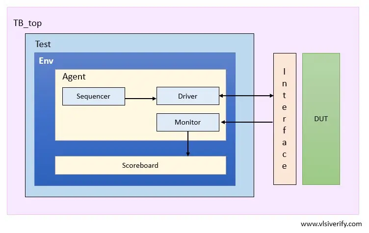

# FIFO-UVM
Register based FIFO tested with UVM

Requirements of this FIFO:

- Synchronous
- Register based
- Data width: 8 bits
- Depth: 16 entries 
- Total size: 8*16 = 128 bits
- Full, Empty, Almost Full, Almost Empty flags (almost full when 14 or more entries are filled, almost empty when 2 entries or less are filled)
- write enable, write data, read enable, read data signals
- Ignores illegal operations (write when full, read when empty)

Inputs:

- clk: Clock signal
- rst_n: Active low reset signal
- wr_en: Write enable signal
- wr_data[7:0]: 8-bit write data input
- rd_en: Read enable signal

Outputs:
- rd_data[7:0]: 8-bit read data output
- full: FIFO full flag
- empty: FIFO empty flag
- almost_full: FIFO almost full flag
- almost_empty: FIFO almost empty flag

Things to test:
- Reset Behavior at different scenarios (reset on and off when other vars are on)
- Normal write and read operations
- Full and empty conditions
- Almost full and almost empty conditions
- Simultaneous read and write operations (even when empty and full, only the write should operate if empty and read if full)
- Illegal operations (writing when full, reading when empty)
- Wrap-around behavior of read and write pointers (ring buffer implementation)


For UVM-FIFO:
```
/bin/tcsh

source /CMC/scripts/synopsys.vcs_verdi.2024.09-SP1.csh

cd ~/FIFO-UVM

vcs -sverilog -timescale=1ns/1ps -full64 -debug_access+all -kdb rtl/FIFO.sv tb/FIFO_tb.sv tb/FIFO_tb_random.sv -o simv
```

Then do this to open Verdi + run simulation
```
./simv

verdi -ssf novas.fsdb -dbdir simv.daidir &
```
or (this one is slow)
```
./simv -gui=verdi
```

For coverage (FIFO):

VCS Compilation
```
vcs -sverilog -timescale=1ns/1ps -full64 -debug_access+all -kdb -cm line+cond+fsm+tgl -cm_dir fifo_cov.vdb rtl/FIFO.sv tb/FIFO_tb.sv -o simv
```

Simulation with coverage collector
```
./simv -cm line+cond+fsm+tgl -cm_dir fifo_cov.vdb -cm_name simple_test
```

View coverage result with Verdi
```
verdi -cov -covdir fifo_cov.vdb -ssf novas.fsdb &
```

To Clean:
```
rm -rf simv* csrc *.daidir AN.DB work *.log
```


image taken from https://vlsiverify.com/uvm/uvm-environment/